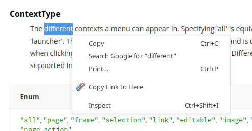

# Copy Link to Here

A small chrome extension which uses the text node linking API in modern browsers to copy a link pointing to the highlighted text.

## Installation

Just clone this repo, and load it as an unpacked extension in Chrome.